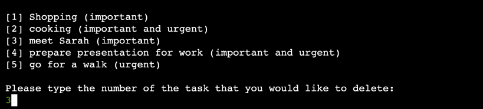

# prio butler

Too many task at once and don’t know what to focus on first? Alfred, your own personal butler has come to help organizing your priorities.

prio butler’s process of prioritizing tasks is based on a popular matrix used by many companies and product teams around the world. By asking you just a couple of questions, Alfred will recommend which tasks you should prioritize more and which ones you might want to work on at a later point in time.

[Link to prio butler](https://prio-butler-9c7d25e6030a.herokuapp.com/)


## Product Decisions

### User Needs

As a user I want to...

- have an overview of all of my tasks so that I don’t have to be worried to forget them
- have my tasks well-prioritized so that I know exactly which ones to focus on first
- have my list of priorities in digital form so that I can easily access them while I’m working
- be guided through the task prioritization process so that I don’t waste my time unnecessarily

### MVP

prio butler’s core functionalities focus on making sure that the most important user problems are addressed first. The user has the option to create a new task, show a list of all open tasks and their priorities, delete a task and quit the program.

### The Eisenhower Matrix

As mentioned in the introduction, the prioritization of the tasks is based on a popular matrix used by companies and product teams - The Eisenhower Matrix. Each of the tasks the user submits is evaluated based on two important criteria: importance and urgency. When the user requests to see all the tasks, they are returned as a prioritized list.


## Design Decisions

### Preparation

Before starting to code it was important to prepare a rough flow of the program to ensure that there are no unexpected obstacles and the user journey flows smoothly.


[Link to the wireframe](https://github.com/dev-timm/prio-butler/tree/main/assets/images/wireframe)


### Usability

As the UI is very limited due to the fact the the program runs in the terminal, the focus of the design lies purely on the usability.

#### Layout

To achieve an easy and effortless overview of the interface, there are line spaces added intentionally between sections. This helps the user to digest larger amounts of text information better and therefore increases the overall user experience.

#### Colors

To further improve the usability of the program, user’s input is displayed in a light green color. This enables the user to quickly scan through their own inputs.

#### Interaction Style

To bring more life into the application, prio butler was designed in a way that the users feel like they interact with another human. “Alfred”, the personal butler, leads the users through the application until they decide to close it. Therefore, it is intended that the user enters short words to navigate through the app instead, for example, numbers in front of the options.

## Features

### Welcome Message

When starting the program users are welcomed by Alfred who then asks for their name. Depending on whether the user is a new one or a returning one, they will be redirected to a different flow. New users will be prompted to create their first task, while returning users will be redirected to the main menu.


### Menu

The menu gives users a choice between four different actions: create a task, show all tasks, delete a task and quit the program.


### Create a New Task

The user can create a new task by it giving a title and deciding whether the task is important and/or urgent.


### Show List of Tasks

The user can see all added tasks in one list. The list is structured into different sections depending on how the user evaluated them based on the questions regarding importance and urgency.


### Delete a Task

Any task that was created can also be deleted by the user. This feature displays a list of all tasks and by typing the number to its left, the task will be deleted.



### Goodbye Message

When the user decides to quit the program, a goodbye message will be displayed.


## Testing 

The program was tested with Code Institute’s own [Python Linter](https://pep8ci.herokuapp.com/) and no significant issues were found.

### Feature Testing
| Feature | Action | Expected Behaviour | Pass/Fail
| --- | --- | --- | --- |
| Welcome Message | Enter new username | User has to create new task | Pass
| Welcome Message | Enter existing username | user is redirected to the program menu | Pass
| Menu | Enter "new" | user has to create a new task | Pass
| Menu | Enter "show" | user sees all created tasks in a list | Pass
| Menu | Enter "delete" | user sees a list of tasks to delete | Pass
| Menu | Enter "quit" | user sees a goodbye message and program closes | Pass
| Menu | Enter empty input | show error message and prompt user to enter a valid option | Pass
| Create a new task | Enter task title | User is prompted to say if task is important or not | Pass
| Create a new task | Enter empty input as a task title | User is prompted to to enter a valid task title | Pass
| Create a new task | Enter importance of task | User is prompted to say if task is urgent or not | Pass
| Create a new task | Enter empty input as importance | User is prompted to choose between "yes" and "no" | Pass
| Create a new task | Enter anything else than "yes" and "no" as importance | User is prompted to choose between "yes" and "no" | Pass
| Create a new task | Enter urgency of task | User sees total number of tasks created and the menu | Pass
| Create a new task | Enter empty input as urgency | User is prompted to choose between "yes" and "no" | Pass
| Create a new task | Enter anything else than "yes" and "no" as urgency | User is prompted to choose between "yes" and "no" | Pass
| List of priorities | If no task is important and urgent | User sees positive message that no high-priority tasks exist | Pass
| List of priorities | If at least one task is important and urgent | User sees list of all high-priority tasks | Pass
| List of priorities | If no task is important | Section for important tasks is not displayed | Pass
| List of priorities | If at least one task is important but not urgent | User sees list of all important tasks | Pass
| List of priorities | If no task is urgent | Section for urgent tasks is not displayed | Pass
| List of priorities | If at least one task is urgent but not important | User sees list of all urgent tasks | Pass
| List of priorities | If there are no important nor urgent tasks | Section for not important and not urgent tasks is not displayed | Pass
| List of priorities | If at least one task is not important and not urgent | User sees list of all not urgent and not important tasks | Pass
| Delete a task | Enter the number of the task to be deleted | Task is removed from the list, user sees total number of tasks created and the menu | Pass
| Delete a task | Enter text | Show error message and prompt user to enter a number within a valid range | Pass
| Delete a task | Enter number lower than 1 or higher than the last task in the list | Show error message and prompt user to enter a number within a valid range | Pass
| Delete a task | Enter empty input | Show error message and prompt user to enter a number within a valid range | Pass

## Deployment

### Deploying the program to Heroku

1. Log into Heroku and make sure you are in the "Dashboard" section
2. Click on the top right button “New” and select “Create new app”
3. Enter app name and choose your region
4. Click on the “Create app” button
5. Go to “Settings” and add config vars (if necessary) and buildpacks
6. Go to “Deploy” section and connect to your GitHub account
7. Decide between automatic or manual deployment and click on the corresponding button
8. If the build is completed successfully, you should see a button to view the deployed application

### Cloning the repository

1. Visit the GitHub page of the website’s repository.
2. Click the “Code” button on top of the page.
3. Click on “HTTPS” below the “Clone” section.
4. Click on the copy button next to the link to copy it.
5. Open your IDE.
6. Type  ```git clone <copied URL>``` into the terminal.
7. If everything's done right, you should now see a cloned repository in your IDE.
